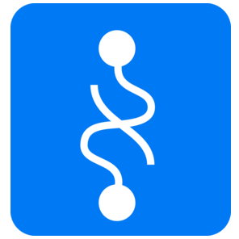
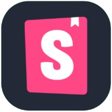

# Hi there 🦄

I'm a frontend-oriented engineer crafting user-friendly products with a full-stack perspective.

## 🧠 Backend

  
  
  
  
  
  
  
  
  

## 💅 Frontend

  
  
  
  
  
  
  
  
    
  
  
    
  
  
    
  
  
  
  
  
  
  
    
  
  

## 📱 Mobile

  
  
  

## ☁️ Infrastructure / Database / DevOps

  
  
  
  
  
  
  
  
  
  
  
  

## 🎨 Design

  
  
  
  

## 🤖 Hardware

  

